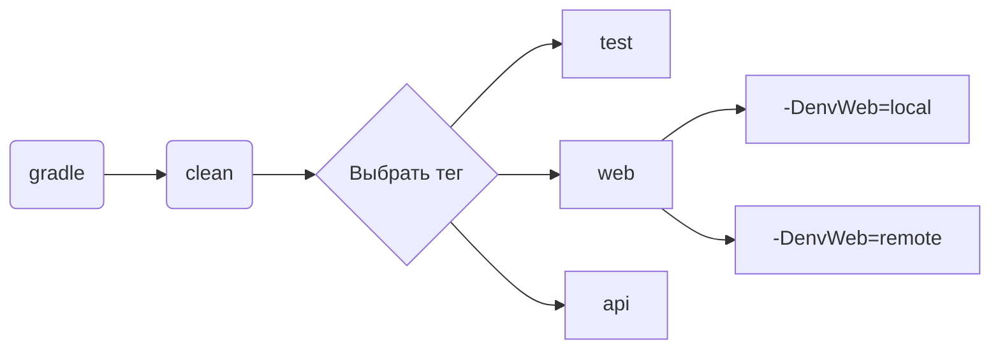
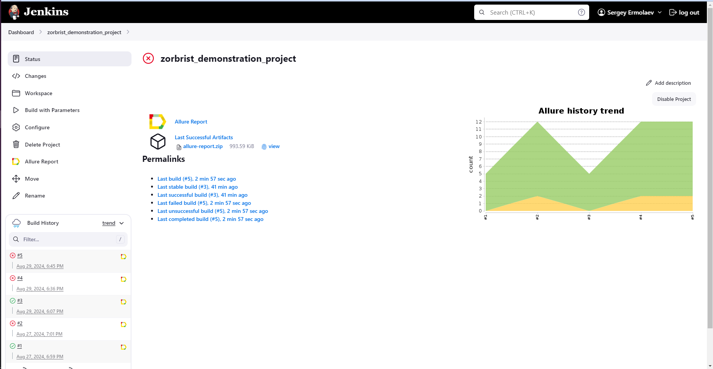
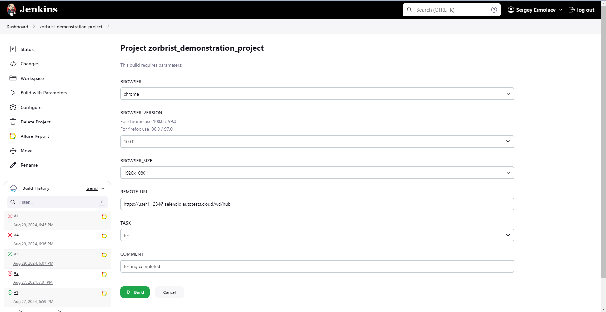
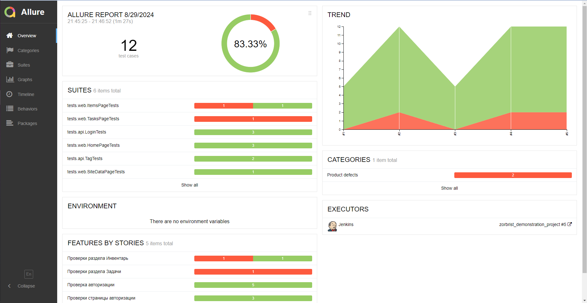
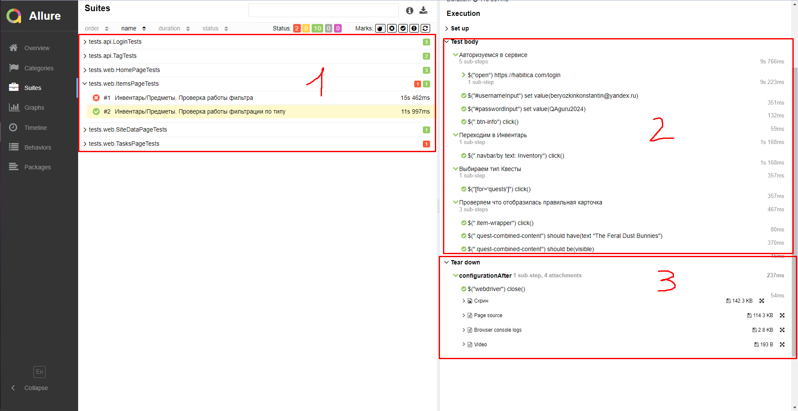
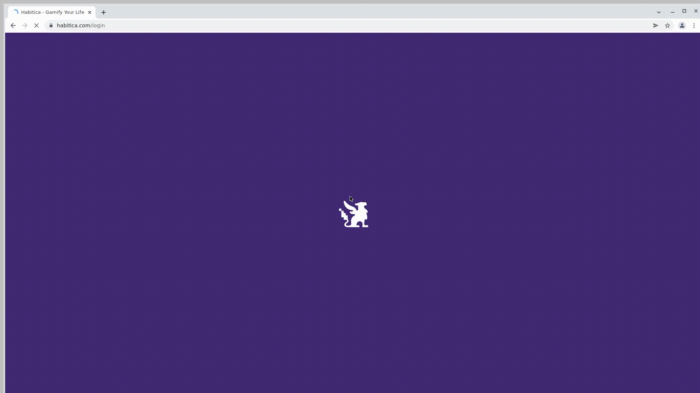

<h1>Проект автоматизации тестирования <a target="_blank" href="https://habitica.com/"> Habitica.com </a> </h1>

<p align="center">

</p>

## Содержание
+ [Описание](#Описание)
+ [Технологии и инструменты](#Технологии-и-инструменты)
+ [Реализованные проверки](#Реализованные-проверки)
+ [Запуск тестов](#Запуск-тестов)
    + [Допустимые комбинации](#Допустимые-комбинации)
    + [Локальный запуск тестов](#Локальный-запуск-тестов)
    + [Удаленный запуск тестов](#Удаленный-запуск-тестов)
+ [Cборка тестов в Jenkins](#Cборка-тестов-в-Jenkins)
+ [Интеграция с Allure Report](#интеграция-с-allure-report)
    + [Диаграммы прохождения тестов](#Диаграммы-прохождения-тестов)
    + [Развернутый результат прохождения тестов](#Развернутый-результат-прохождения-тестов)
+ [Пример выполнения теста в Selenoid](#Пример-выполнения-теста-в-Selenoid)

## Описание
Habitica — трекер задач, который совместил философию RPG и GTD(доведение дел до завершения) в своей веб-версии.
Проект состоит из UI-тестов и API тестов. <br/>

**Особенности проекта**:
- `Page Object` шаблон проектирования
- Использование техноголии `Owner` для придания тестам гибкости и легкости конфигурации
- Возможность запуска тестов: локально, удалённо, по тегам
- Использование `Lombok` для моделей в API тестах
- По итогу прохождения автотестов генерируется Allure отчет. Содержание отчета:
  - Шаги теста
  - Скриншот страницы на последнем шаге
  - Исходный код страницы в браузере
  - Логи консоли браузера
  - Видео выполнения автотеста

## Технологии и инструменты

<div align="center">
<a href="https://www.jetbrains.com/idea/"></a>
<a href="https://github.com/"></a>  
<a href="https://www.java.com/"></a>
<a href="https://gradle.org/"></a>  
<a href="https://junit.org/junit5/"></a>
<a href="https://selenide.org/"></a>
<a href="https://aerokube.com/selenoid/"></a>
<a href="https://rest-assured.io/"></a>
<a href="https://www.jenkins.io/"></a>
<a href="https://github.com/allure-framework/"></a>
</div>

## Реализованные проверки
### Web
- [x] Проверка страницы регистрации
- [x] Проверка алерта при регистрации с пустыми полями
- [x] Проверка редиректа на страницу авторизации при нажатии на кнопку Вход
- [x] Инвентарь/Предметы. Проверка работы фильтрации по типу
- [x] Инвентарь/Предметы. Проверка работы фильтра
- [x] Проверка текста всплывающей подсказки с идентификатором пользователя
- [x] Добавление привычки

### Api
- [x] Выполнение успешного запроса на вход в систему
- [x] Выполнение неудачного запроса на вход в систему с пустым паролем
- [x] Выполнение запроса на вход в систему с пустым телом
- [x] Запрос текущего списка тегов
- [x] Выполнение запроса на удаление тега

## Запуск тестов
> [!NOTE]
> Убедитесь, что у вас установлены Java, Gradle, IntelliJ IDEA и в качестве браузера используется Chrome
>

Конфигурационные файлы `.properties` лежат в папке `resources`. <br/>
При необходимости можно изменить их.

### Допустимые комбинации



### Локальный запуск тестов
#### Запуск всех тестов

Для запуска следует открыть IntelliJ IDEA и выполнить в терминале:
```
gradle clean test
```

или

```
gradle clean test -Denv=local
```

#### WEB

```
gradle clean web
```


#### API
```
gradle clean api 
```

<details>
   <summary>Дополнительные команды:</summary>

1. Выполнить запрос на формирование отчета:
```
gradle allureReport
```
2. Открыть отчет в браузере:
```
gradle allureServe
```

</details>

### Удаленный запуск тестов
Тесты можно запустить из терминала IntelliJ IDEA, а выполнены они будут в удаленно запущенном браузере в Docker-контейнере Selenoid:

```
gradle clean test -Denv=remote
```

Параметры, которыми можно управлять:
```
-DbrowserName - наименование браузера. По умолчанию chrome
-DbrowserVersion - номер версии браузера. По умолчанию 100.0
-DbrowserSize - размер окна браузера. По умолчанию 1980x1080
-DremoteUrl - адрес удаленного сервера, на котором будут запускаться тесты
```
## Cборка тестов в <b><a target="_blank" href="https://jenkins.autotests.cloud/job/zorbrist_demonstration_project/">Jenkins</a></b>

>Для запуска сборки необходимо перейти в раздел `Build with Parameters` и нажать кнопку `Build`



> Сборка с параметрами позволяет перед запуском задать нужные параметры для сборки:

<p align="center">

</p>

## Интеграция с <b><a target="_blank" href="https://jenkins.autotests.cloud/job/zorbrist_demonstration_project/allure/">Allure report</a></b>
#### Диаграммы прохождения тестов
`ALLURE REPORT` - отображает дату и время теста, общее количество запущенных тестов, а также диаграмму с процентом и количеством успешных, упавших и сломавшихся в процессе выполнения тестов <br/>
`TREND` - отображает тенденцию выполнения тестов для всех запусков <br/>
`SUITES` - отображает распределение тестов по сьютам <br/>
`CATEGORIES` - отображает распределение неудачных тестов по типам дефектов



#### Развернутый результат прохождения тестов:
1. Общий список автотестов
2. Содержание автотеста
3. Вложения

   

## Пример выполнения теста в Selenoid

> К каждому UI-тесту в отчете прилагается видео
<p align="center">
  
</p>